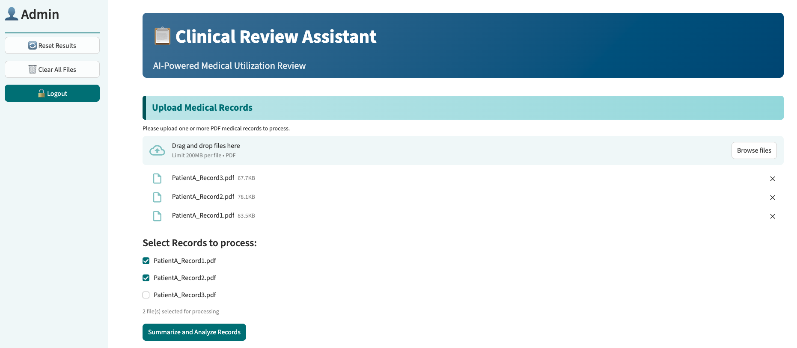
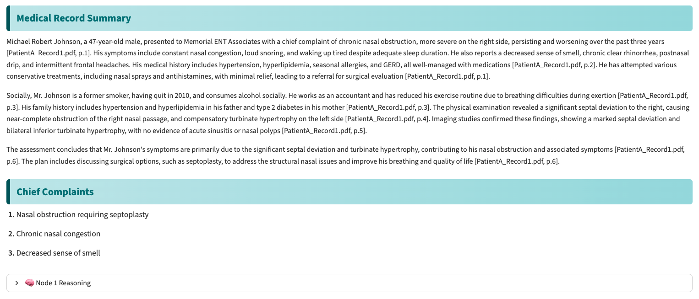
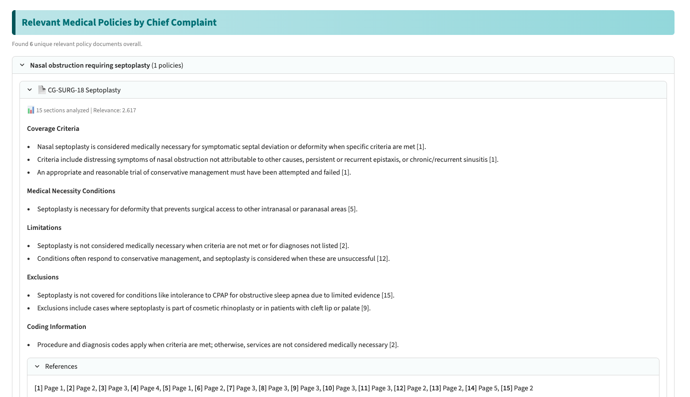

# Clinical Review Assistant (CRA)

## Project Description

The Clinical Review Assistant is a human-in-the-loop web application that automates medical utilization review workflows by analyzing patient medical records against user-eneterd criteria using AI agents. The system employs a three-node LangGraph workflow that summarizes medical records, retrieves relevant policies from a vector database, and evaluates user-entered criteria with evidence-based reasoning. Built with dual RAG architecture (Pinecone for persistent policies, ChromaDB ephemeral for HIPAA-compliant medical records), the system reduces review time significantly while maintaining consistent, auditable decision-making.

## Key Features

**Advanced Techniques:**
- **Agentic Workflow (LangGraph)**: Three-node agent with conditional routing and state management
- **Dual RAG Architecture**: Pinecone (persistent policies with hybrid search) + ChromaDB (ephemeral medical records)
- **Hybrid Retrieval for evaluation**: Combines keyword matching for factual data with semantic search for medical concepts
- **Domain-Specific Embeddings**: SapBERT medical embeddings for clinical terminology understanding
- **Query expansion with LLM and Cross-Encoder Reranking**: Improved precision acorss varied clinical terms.
- **Advanced Prompt Engineering**: Few-shot examples, explicit constraints, structured output templates

**Core Capabilities:**
- Automated medical record summarization with inline citations
- Intelligent policy retrieval based on extracted chief complaints
- Evidence-based criteria evaluation (Met/Not Met/Insufficient Data)
- Confidence scoring based on similarity metrics
- HIPAA-compliant ephemeral processing (no PHI persistence)
- Security audit logging for all actions

## Screenshots

### Main Interface

*Step 1: Upload and select medical record PDFs for processing*

### Medical Summary and Chief Complaints

*Step 2: AI-generated clinical summary with inline citations and chief complaints*

### Policy Retrieval

*Step 3: Relevant insurance policies retrieved via RAG with relevance scoring*

### Criteria Evaluation

*Step 4: Criteria evaluation with evidence table, confidence scores, and citations*

## Setup Instructions

### Prerequisites
- Python 3.9 or higher
- OpenAI API key
- Pinecone API key and index (for policy database)

### Installation

1. **Clone repository**
```bash
git clone https://github.com/mudejayaprakash/clinical-review-assistant.git
cd clinical-review-assistant
```

2. **Install dependencies**
```bash
pip install -r requirements.txt
```

3. **Configure environment variables**
```bash
cp .env.example .env
# Edit .env file and add your API keys:
OPENAI_API_KEY=your_openai_key_here
PINECONE_API_KEY=your_pinecone_key_here
PINECONE_INDEX_NAME=medical-policies
PINECONE_NAMESPACE=policies
```

4. **Initialize vector database (Pinecone)**
```bash
# Place policy PDF files in data/raw_policy_pdf/
python data_ingestion.py
# This will:
# - Extracts text from policy PDFs
# - Creates chunks with section-aware splitting
# - Generates embeddings using SapBERT
# - Uploads to Pinecone index
```

5. **Run the application**
```bash
streamlit run app.py
```

6. **Access the interface**
```
Open browser to: http://localhost:8501
```
  **First-time Setup:**
  - Click "Register" to create a new account
  - Enter desired username and password
  - Click "Create Account"
  - Login with your new credentials

  **Subsequent Use:**
  - Enter your username and password
  - Click "Login"

## How to Use

### Basic Workflow

**Step 1: Upload Medical Records**
- Click "Browse files" and select one or more PDF medical records of same patient at a time.
- Use checkboxes to select which files to process.

**Step 2: Process Records**
- Click "Summarize and Analyze Records"
- Wait for Node 1 (🔄 Step 1/2: Processing medical records...) and Node 2 (🔄 Step 2/2: Retrieving relevant policies from Pinecone...) to complete
- System will:
  - Extract text from PDFs with page tracking
  - Generate clinical summary with inline citations
  - Identify chief complaints
  - Retrieve relevant insurance policies from Pinecone

**Step 3: Review Results**
- Examine the clinical summary with citations
- Review identified chief complaints
- Browse retrieved policies (expandable sections with references)

**Step 4: Evaluate Criteria**
- Enter approval criteria to evaluate (one per line)
- Example criteria:
```
  • Patient must be 18 years or older
  • Documented diagnosis of chronic nasal obstruction ≥3 months
  • Conservative medical management has failed
  • CT scan or endoscopy confirms septal deviation
```
- Click "Evaluate Criteria"
- Review results showing:
  - Status: Met / Not Met / Insufficient Data
  - Reasoning for determination
  - Evidence table with source citations and confidence scores

**Step 5: Export or Continue**
- Results remain in session for reference
- Click "🗑️ Clear All Files" if needed to clear everything
- Click "🔄 Reset Results" to just clear the results
- Click "🔓 Logout" to end session

## Team Member Contributions

- **Mude Jayaparakash Naik**: Agent architecture design, LangGraph implementation, Node 1 & 2 development
- **Sonal Shreya**: RAG system design, Pinecone integration, hybrid search implementation, Node 3 evaluation logic.
- **Sumit Singh**: Prompt engineering, Streamlit UI development, user experience design, authentication and security system, testing and validation

## Technologies Used

### Core Framework
- **LangGraph**: Agent orchestration and workflow management
- **LangChain**: LLM abstraction and document processing utilities
- **Streamlit**: Web application interface

### Language Models
- **OpenAI GPT-4o**: Medical record summarization (Node 1), policy summarization (Node 2),Criteria evaluation (Node 3).
- **OpenAI GPT-4o-mini**:  Query Expansion (Node 2 RAG) - cost-optimized

### Embeddings & Vector Databases
- **SapBERT** (cambridgeltl/SapBERT-from-PubMedBERT-fulltext): Medical domain embeddings (Node 1 & 2)
- **Cross-Encoder** (ms-marco-MiniLM-L-6-v2): Document reranking (Node 2)
- **Pinecone**: Persistent vector database for policy documents with hybrid search (Node 2)
- **ChromaDB**: Ephemeral in-memory vector database for medical records (HIPAA compliance) (Node 1 & 3)

### Document Processing

**Medical Records (Node 1):**
- **UnstructuredPDFLoader**: PDF parsing with page number extraction
- **RecursiveCharacterTextSplitter**: 1000 tokens with 200 overlap*

**Policy Documents (Node 2- Pinecone Ingestion):**
- **Section-Aware Chunking**: 800 tokens with 100 overlap*
- **Regex-Based Section Detection**: Identifies policy sections (Medically Necessary, Limitations, etc.)

**Overlap preservation maintains context across chunk boundaries*

### Security & Utilities
- **python-dotenv**: Environment variable management
- **Custom authentication**: User login system
- **Security logging**: Audit trail for all actions

## Known Limitations

- **Limited dataset** : Tested on limited set of medical procedures using a small collection of representative medical records
- **No clinical reviewer testing**: Built without MD/RN validation loop
- **Real-world noise**: Assumes well-scanned, legible documents
- **Human oversight required**: Human validation remains essential for clinical safety.

## Future Improvements

- **Real-world training**: Incorporate de-identified medical records for greater complexity and realism.
- **Integrated interface**: Enable side-by-side viewing of original records and extracted evidence in the UI.
- **Clinical validation**: Involve nurses and medical experts in future testing and feedback loops.
- **Domain adaptation**: Fine-tune prompts by medical specialty for improved accuracy.
-**Performance tracking**: Add analytics dashboards for accuracy and quality monitoring.


## Cost Estimation

**Per Medical Review (typical):**
- Node 1 Summary: ~$0.05 (GPT-4o)
- Node 2 Policies: ~$0.07 + ~0.001 (GPT-4o + GPT-4o-mini)
- Node 3 Evaluation (5 criteria): ~$0.08 (GPT-4o)
- **Total**: ~$0.20 per complete review

**Monthly (1,000 reviews):** ~$200 in LLM API costs
- Pinecone: Free tier supports up to 1M vectors
- SapBERT embeddings: Free (runs locally)
- ChromaDB: Free (open-source, runs locally)

## Security & Compliance

- ✅ **HIPAA Compliant Design**: Ephemeral processing, no PHI persistence
- ✅ **API Key Protection**: Environment variables, never committed to repository
- ✅ **Input Validation**: PDF validation, file size limits, content sanitization
- ✅ **Audit Logging**: All actions logged with user ID and timestamp
- ✅ **Access Control**: Authentication required for all operations

## Academic Project

The project was developed as a final project for Text Analytics (ISM 6564) at University of South Florida, Fall 2025.

## Contact

**Project Team**: Alpha Neurons
- GitHub: https://github.com/mudejayaprakash/Clinical_Review_Assistant

## Acknowledgments

Special thanks to:
- Professor Dr.Tim Smith for guidance on agentic AI systems
- OpenAI for GPT-4 API access
- Pinecone for vector database platform
- The open-source community for LangChain, LangGraph, and supporting libraries